<p align="center">
  
</p>

<p align="center">
  <a href="https://abdulrahman-alsaadi.github.io/">
    
  </a>
</p>

<br>

<table>
<tr>
<td width="58%">

### `00 / SIGNAL`

```text
MECHANICAL SYSTEMS  ←→  EMBEDDED CONTROL
          ↑                    ↓
      REAL HARDWARE  ←→  AUTONOMY
```

I like engineering where the **CAD leaves the screen**,  
the **software touches hardware**,  
and the final answer is something you can actually test.

</td>
<td width="42%">

### `01 / CURRENT VECTOR`

```yaml
focus:
  - robotics
  - autonomous systems
  - mechanical design

mode: build → integrate → validate
status: always iterating
```

</td>
</tr>
</table>

<br>

<p align="center">
  
</p>

<br>

### `02 / FROM THE LAB`

> Not a list of everything I know — just a few systems that made it off the whiteboard.

| System | Signal |
|:--|:--|
| **[SCARA Robot Arm](https://github.com/ABDULRAHMAN-ALSAADI/scara-robot-arm)** | CAD → manufacturing → kinematics → embedded control → physical validation |
| **[WD Drone Autonomous Mission](https://github.com/ABDULRAHMAN-ALSAADI/wd-drone-autonomous-mission)** | simulation → vision → MAVLink → companion computer → flight testing |
| **6-DOF Cycloidal Arm** | reducer architecture → torque sizing → tolerance design → prototype next |

<br>

### `03 / ENGINEERING DNA`

<p align="center">
  <code>DESIGN FOR REALITY</code>
  &nbsp;·&nbsp;
  <code>TEST BEFORE CLAIM</code>
  &nbsp;·&nbsp;
  <code>DOCUMENT THE WHY</code>
  &nbsp;·&nbsp;
  <code>ITERATE</code>
</p>

<br>

---

<p align="center">
  <sub>There is more behind every project than fits on a GitHub profile.</sub>
</p>

<h3 align="center">
  <a href="https://abdulrahman-alsaadi.github.io/">→ OPEN THE FULL ENGINEERING PORTFOLIO ←</a>
</h3>

<p align="center">
  <sub>Building something that moves, thinks, or both?</sub>
</p>
